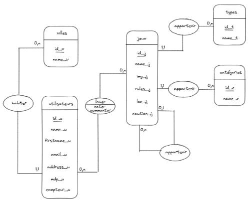
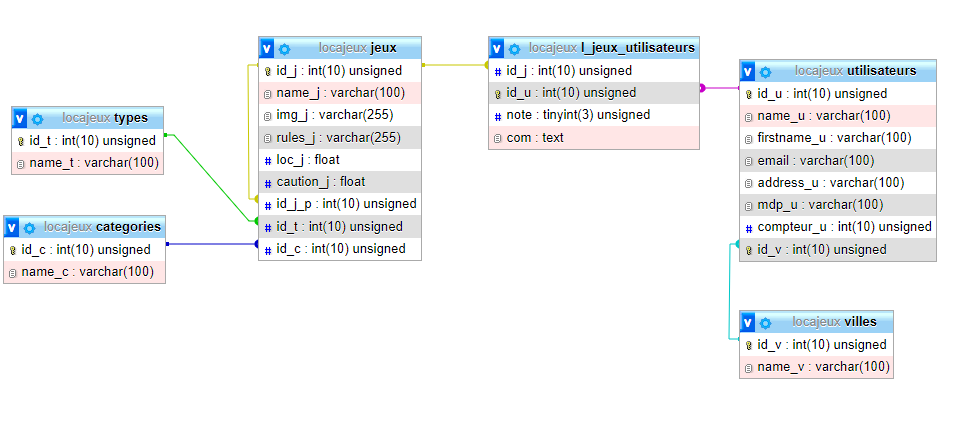

# Bases de données
## MCD
### Règles de gestion
+ **Un jeu aura :**
   * un id unique
   * un nom
   * une image carré
   * un fichier
   * un fichier de règle en PDF
   * un identifiant du jeux parents si c'es une extension
   * un prix de location
   * un prix de caution
+ **Un type aura :**
   * un id unique
   * un nom
+ **Une catégorie aura :**
   * un id unique
   * un nom
+ **Un utilisateur aura :**
   * un id unique
   * un nom
   * un prénom
   * un mail
   * un mot de passe
   * une adresse
   * un compteur de jeux loué
+ **Une ville aura :**
   * un id unique
   * un nom
+ **Un jeu aura un et un seul stype**
+ **Un jeu aura une et une seule catégorie**
+ **Un utilisateur pourra louer un ou plusieurs jeux**
+ **Un utilisateur a une et une seule ville**

### Dictionnaire de données
| **Code Mnemonic** | **Description**          | **Type** | **Taille** | **Commentaire**     |
|-------------------|--------------------------|----------|------------|---------------------|
|id_j               | identifiant jeu          | N        | 10         | UNSIGNED            |
|name_j             | nom jeu                  | AN       | 100        |                     |
|img_j              | image jeu                | AN       | 255        | carre (ex: 200*200) |
|rules_j            | règles jeu               | AN       | 255        |                     |
|loc_j              | prix location jeu        | N        | 5          | UNSIGNED            |
|caution_j          | prix caution  jeu        | N        | 5          | UNSIGNED            |
|id_t               | identifiant type         | N        | 10         | UNSIGNED            |
|name_t             | nom type                 | AN       | 100        |                     |
|id_c               | identifiant catégorie    | N        | 10         | UNSIGNED            |
|name_c             | nom catégorie            | AN       | 100        |                     |
|id_u               | identifiant utilisateur  | N        | 10         | UNSIGNED            |
|name_u             | nom utilisateur          | AN       | 100        |                     |
|firstname_u        | prenom utilisateur       | AN       | 100        |                     |
|email_u            | email utilisateur        | AN       | 100        |                     |
|address_u          | address utilisateur      | AN       | 100        |                     |
|mdp_u              | mot de passe utilisateur | AN       | 100        | doit être haché     |
|compteur_u         | compteur jeu utilisateur | N        | 10         |                     |
|id_v               | identifiant ville        | N        | 10         | UNSIGNED            |
|name_v             | nom ville                | AN       | 100        |                     |

### Dépendance fonctionnelles
+ **id_j** ?name_j, img_j, rules_j, loc_jcaution_j
+ **id_t** ? name_t
+ **id_c** ? name_c
+ **id_u** ? name_u, firstname_u, email_u, address_u, mdp_u, compteur_u
+ **id_v** ? name_v

### Schéma MCD

## MLD
+ types (**id_t**, name_t)
+ categories (**id_c**, name_c)
+ utilisateurs (**id_u**, name_u, firstname_u, email_u, address_u, mdp_u, compteur_u, #id_v)
+ jeux (**id_j**, name_j, img_j, rules_j, loc_j, caution_j, #id_t, #id_c, #id_j_p)
+ l_jeux_utilisateurs (**#id_j**, **#id_u**, note, com)
+ villes (**id_v**, name_v)

## MPD

# Début du projet
J'ai commencé par créer une petite "base de données" en fichier .txt en imaginant qu'un client aurait pu la fournir.  
Je l'ai ensuite importer dans la base de donnée, dans un premier temps grâce à une requête query puis,  
finalement par une requête préparée pour m'exercer sur ces requêtes qui seront plus sécurisés de manière générale.

# Création du moteur de recherche
J'ai d'abbord créer le moteur de recherche avec 8 else/elseif pour gérer tous les cas possible.
J'ai finalement mofifié ce moteur de recherche en créant la requête SQL en récupérant les données de la super global GET pour diminuer grandement le nombre de if et simplifier le code

# Création de la page jeu
J'ai créé la page jeu qui affichera toutes les infos du jeu
Pour cela j'ai décidé simplement d'ajouter l'id du jeu voulu dans l'url afin de le récupérer dans le tableau GET
J'ai ensuite ajouté un bouton Louer qui n'apparaitra que si le jeu est disponible et que l'utilisateur est connecté.

# Création de la connexion
J'ai créé un formulaire de connexion dans la modale
le formualire envoie sur la page de connexion qui sert au traitement de la connexion.
J'ai décider d'utiliser la super global SERVER avec [HTTP_REFERER] pour rediriger vers la page précédent la connexion pour améliorer l'experience utilisateur.

# Création de la page déconnexion
Idem que la connexion
j'ai décidé d'utiliser Refresh: 1 dans la redirection pour que l'utilisateur reste 1 seconde sur la page éconnexion afin d'afficher un msg de déco.

# Création de la page mon compte
La page mon compte sert afficher les infos de l'utilisateur connecté.
Elle servira également à indiquer le nombre de jeu que l'utilisateur à loué.

# Création de l'inscription
J'ai créé un formulaire d'inscription dans la modale
le formualire envoie sur la page de inscription qui sert au traitement de l'inscription.
Il a fallut créer plusieurs exceptions pour géer les erreurs tel que un email déjà inscrit, une mauvaise date, un email au mauvais format, l'inscription d'un mineur.
J'ai décidé de créer plusieurs exceptions que j'ai regroupé avec l'exception InscriptionExeption afin de simplifier le code en évitant de multiple catch.
